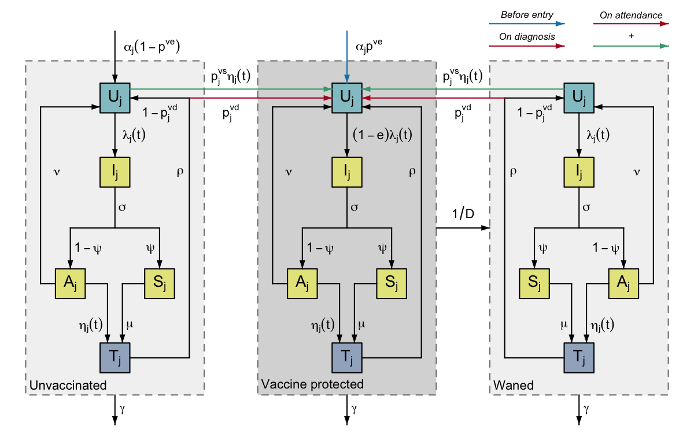

# gonovax

<!-- badges: start -->
[](https://www.repostatus.org/#concept)
[](https://github.com/mrc-ide/gonovax/actions)
[](https://www.codefactor.io/repository/github/mrc-ide/gonovax)
[](https://codecov.io/gh/mrc-ide/gonovax)
<!-- badges: end -->

This package implements a compartmental model of gonorrhoea infection with vaccination.




## Installation

You will need a compiler to install dependencies for the package, and to build
the models. Use `pkgbuild::check_build_tools()` to see if your system is usable.

You will need the packages `odin` and `mcstate`, which can be installed using:

```r
remotes::install_github("mrc-ide/odin", upgrade = FALSE)
remotes::install_github("mrc-ide/mcstate", upgrade = FALSE)
```


The package can then be installed directly from GitHub with:

```r
remotes::install_github("mrc-ide/gonovax", upgrade = FALSE)
```

## License

MIT © Imperial College of Science, Technology and Medicine

